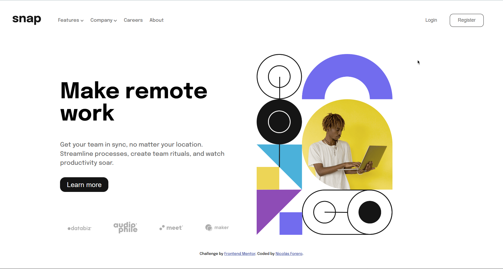

# Frontend Mentor - Intro section with dropdown navigation solution

This is a solution to the [Intro section with dropdown navigation challenge on Frontend Mentor](https://www.frontendmentor.io/challenges/intro-section-with-dropdown-navigation-ryaPetHE5). Frontend Mentor challenges help you improve your coding skills by building realistic projects.

## Table of contents

- [Overview](#overview)
  - [The challenge](#the-challenge)
  - [Screenshot](#screenshot)
  - [Links](#links)
- [My process](#my-process)
  - [Built with](#built-with)
  - [What I learned](#what-i-learned)
  - [Continued development](#continued-development)
- [Author](#author)

**Note: Delete this note and update the table of contents based on what sections you keep.**

## Overview

### The challenge

Users should be able to:

- View the relevant dropdown menus on desktop and mobile when interacting with the navigation links
- View the optimal layout for the content depending on their device's screen size
- See hover states for all interactive elements on the page

### Screenshot



### Links

- Solution URL: [GitHub Code](https://github.com/byNico1/intro-section-frontend-mentor/settings/pages)
- Live Site URL: [Add live site URL here](https://your-live-site-url.com)

## My process

### Built with

- Semantic HTML5 markup
- CSS custom properties
- Flexbox
- CSS Grid
- Mobile-first workflow

### What I learned

I learned a lot about responsive desgin, I have not used Grid many times, but I used it this time and I felt so comfortable working whith it

```html
<div class="sidebar show">
  <div class="sidebar-inner-container">
    <div class="close-icon-container">
      
    </div>
    <div>
      <ul>
        <li class="first-li">
          Features
          <span class="arrow-dropdown-sidebar">
            

            
          </span>
          <ul class="feat-list-sidebar hidden">
            <li class="first-li li-icon">
              <span class="icon-1">
                
              </span>
              Todo List
            </li>
            <li class="li-icon">
              <span class="icon-2">
                
              </span>
              Calendar
            </li>
            <li class="li-icon">
              <span class="icon-3">
                
              </span>
              Reminders
            </li>
            <li class="li-icon">
              <span class="icon-4">
                </span>
              Planning
            </li>
          </ul>
        </li>

        <li>
          Company
          <span class="arrow-dropdown-company-sidebar">
            

            
          </span>
          <ul class="company-list-sidebar hidden">
            <li class="first-li">History</li>
            <li>Our Team</li>
            <li>Blog</li>
          </ul>
        </li>

        <li class="first-li">Careers</li>
        <li class="first-li">About</li>
      </ul>

      <div class="nav-buttons">
        <button class="login button-nav">Login</button>
        <button class="register button-nav">Register</button>
      </div>
    </div>
  </div>
</div>
```

```css
.main-container {
  display: grid;
  column-gap: 30px;
  grid-template-columns: repeat(2, 1fr);
  grid-template-rows: repeat(3, 1fr);
}

.main-image-container {
  max-width: 325px;
  grid-column: 2 / 3;
  grid-row: 1 / 4;
}

.hero-text {
  align-self: flex-end;
  text-align: left;
  grid-row: 1 / 4;
}

.hero-text__title {
  font-size: 3.8rem;
}

.icons-container {
  grid-column: 1/3;

  align-self: flex-end;
}
```

```js
arrowDropdown.onclick = function () {
  arrowDown.classList.toggle("hidden");
  arrowUp.classList.toggle("hidden");
  if (companyList.classList.value !== "hidden") {
    companyList.classList.add("hidden");
    arrowDownCompany.classList.remove("hidden");
    arrowUpCompany.classList.add("hidden");
  }
  featList.classList.toggle("hidden");
};
```

### Continued development

I would like to use BEM in my next projects and to really inmprove my JavaScript

## Author

- Website - [My Website is in process](https://www.nikofoque.netlify.app)
- Frontend Mentor - [@bynico1](https://www.frontendmentor.io/profile/byNico1)
